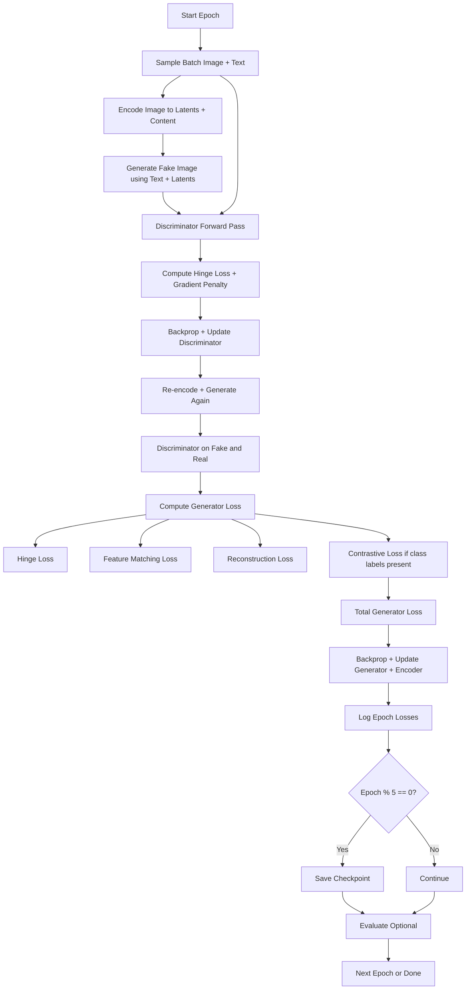

# Generative-Adversarial-Text-to-Image-Synthesis

## 📝 Problem Statement

The objective of this assignment is to implement a **Conditional GAN-based Text-to-Image Synthesis** framework. The model architecture includes three core components:

1. **Source Encoder** – Encodes input images into feature representations.
2. **Target Generator** – Generates realistic images conditioned on the encoded features and input text descriptions.
3. **Discriminator** – Distinguishes between real and generated images.

Unlike traditional GANs, the generator here is conditioned not only on random inputs but also on text and learned image representations. The source encoder replaces random noise with more structured inputs for the generator. All components must be trained from scratch (no pretrained models or checkpoints).

The system should be trained and tested on a randomly selected subset of 25 classes (20 train + 5 test) from the **Oxford-102 Flowers Dataset**, using textual descriptions from the provided [GitHub repository](https://github.com/aelnouby/Text-to-Image-Synthesis?tab=readme-ov-file).

Key requirements:
- All models must be original (no transformers or diffusion models).
- Must be runnable on **Google Colab** and finish within reasonable time (≤ 1 hour preferred).
- Final output includes image grids, t-SNE plots, and model statistics.

The assignment emphasizes model design, training methodology, and creativity in solving the text-to-image synthesis problem.

## My Approach

### Source Encoder  
**Purpose**: Encodes an input image into multiple latent vectors and a content feature map.  
**Innovations**:  
- 📌 **Multiple Latents**: Produces *n* distinct latent vectors to enhance diversity and control.  
- 🧩 **Content Representation**: Extracts intermediate spatial features to retain structural content.

---

### Target Generator  
**Purpose**: Generates an image conditioned on both text and visual latent encodings.  
**Innovations**:  
- ⚡ **Conditional BatchNorm**: Learns adaptive normalization using textual embeddings.  
- 🔄 **Residual Upsampling**: Employs ResNet-style skip connections for stable upscaling and synthesis.

---

### Discriminator  
**Purpose**: Distinguishes real vs. generated images while aligning with text semantics.  
**Innovations**:  
- 🎯 **Spectral Normalization**: Stabilizes training by controlling Lipschitz continuity of conv layers.  
- 📝 **Text-Image Matching**: Projects text into the discriminator space to enforce semantic alignment.

## Training Strategy

**Innovations Introduced:**
- 🎯 **Gradient Penalty** in Discriminator for improved stability  
- 📊 **Hinge Loss** for both Generator and Discriminator  
- 🔗 **Contrastive Loss** to align latent space with class labels  
- 📈 **Feature Matching Loss** to reduce mode collapse

---

### Training Loop Diagram (Mermaid)

## Loss Functions and Training Objectives

Your training pipeline integrates multiple objectives for stable and semantically aligned generation. Below are the mathematical formulations for each:

---

### 1. 📊 Hinge Loss

**Discriminator Hinge Loss**:

$$\mathcal{L}_D = \mathbb{E}_{x \sim p_{\text{real}}}[\max(0, 1 - D(x))] + \mathbb{E}_{\hat{x} \sim p_{\text{fake}}}[\max(0, 1 + D(\hat{x}))]$$

**Generator Hinge Loss**:

$$\mathcal{L}_G = -\mathbb{E}_{\hat{x} \sim p_{\text{fake}}}[D(\hat{x})]$$

---

### 2. 🎯 Gradient Penalty (WGAN-GP-style)

Enforces the Lipschitz constraint by penalizing gradients:

$$\mathcal{L}_{\text{GP}} = \lambda_{\text{gp}} \cdot \mathbb{E}_{\tilde{x} \sim \mathbb{P}_{\text{interp}}} \left[ \left( \|\nabla_{\tilde{x}} D(\tilde{x})\|_2 - 1 \right)^2 \right]$$

Where $\tilde{x} = \alpha x + (1 - \alpha)\hat{x}$, a linear interpolation of real and fake images.

---

### 3. 📈 Feature Matching Loss

Matches intermediate discriminator features of real vs. generated images:

$$\mathcal{L}_{\text{FM}} = \sum_{l} \| f_l(x) - f_l(\hat{x}) \|_1$$

Where $f_l$ are discriminator features at layer $l$.

---

### 4. 🔗 Contrastive Loss (Optional, Supervised)

Encourages similar latent vectors for same-class images:

$$\mathcal{L}_{\text{contrastive}} = \sum_{i < j}
\begin{cases}
\|z_i - z_j\|^2, & \text{if } y_i = y_j \\
\max(0, m - \|z_i - z_j\|)^2, & \text{if } y_i \neq y_j
\end{cases}$$

Where $z_i$ are latent embeddings, and $m$ is a margin hyperparameter.

---

### 5. 🔄 Reconstruction Loss (L1)

Pixel-level reconstruction loss to align generated and real images:

$$\mathcal{L}_{\text{recon}} = \| \hat{x} - x \|_1$$

---

### 📋 Total Generator Loss

$$\mathcal{L}_{\text{G-total}} = \mathcal{L}_G + \lambda_{\text{FM}} \cdot \mathcal{L}_{\text{FM}} + \lambda_{\text{recon}} \cdot \mathcal{L}_{\text{recon}} + \lambda_{\text{contrastive}} \cdot \mathcal{L}_{\text{contrastive}}$$

---

### 📝 Notes

- $\lambda$ values are tunable hyperparameters.
- Contrastive loss is used only when class labels are available.
- All loss components contribute to a balanced and stable training loop.

## Model Parameters

| Model         | Total Params | Trainable Params | Size (MB) |
|---------------|--------------|------------------|-----------|
| Encoder       | 22,096,512   | 22,096,512       | 84.31 MB  |
| Generator     | 3,534,115    | 3,534,115        | 13.52 MB  |
| Discriminator | 11,675,329   | 11,675,329       | 44.63 MB  |

## Results

### Quantitative Evaluation Metrics:

**Inception Score**: 2.1885813649477743 ± 0.09596595874708262

**Frechet Inception Distance**: 184.25644610545228

| Metric | Value |
|--------|-------|
| inception_score_mean | 2.1885813649477743 |
| inception_score_std | 0.09596595874708262 |
| frechet_inception_distance | 184.25644610545228 |

## References:

1. Miyato, T., et al. (2018). "Spectral Normalization for Generative Adversarial Networks."
2. Mirza, M., & Osindero, S. (2014). "Conditional Generative Adversarial Nets."
3. Brock, A., Donahue, J., & Simonyan, K. (2019). "Large Scale GAN Training for High Fidelity Natural Image Synthesis."
4. Karras, T., et al. (2019). "StyleGAN: A Style-Based Generator Architecture for Generative Adversarial Networks."
5. Karras, T., et al. (2020). "StyleGAN2: Analyzing and Improving the Image Quality of StyleGAN."
6. Miyato, T., & Koyama, M. (2018). "ProjGAN: Conditional Generative Adversarial Networks with Projection Discriminator."
7. Reed, S., et al. (2016). "Text-to-Image Generation with Deep Learning."
8. Tao, M., et al. (2020). "DF-GAN: A Simple and Effective Baseline for Text-to-Image Synthesis."
9. Lim, J. H., & Ye, J. C. (2017). "Geometric GAN."
10. Zhang, H., et al. (2019). "Self-Attention Generative Adversarial Networks."
11. Mescheder, L., et al. (2018). "Which Training Methods for GANs do actually Converge?"
12. Gulrajani, I., et al. (2017). "Improved Training of Wasserstein GANs."
13. Karras, T., et al. (2018). "Progressive Growing of GANs for Improved Quality, Stability, and Variation."
